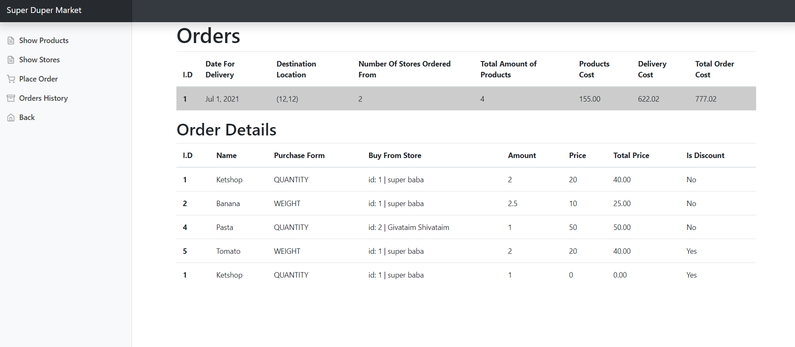
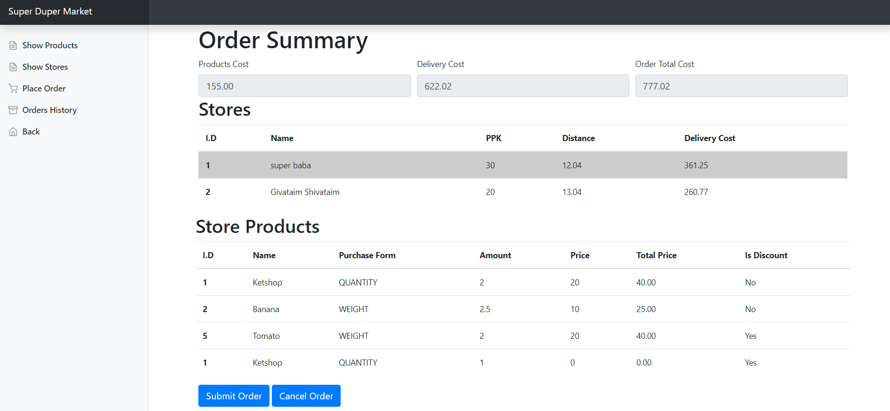

# Super Duper Market
Hi!
Super Duper Market (SDM) is a web platform that I develop for store-owners to upload their stores and get all the infomation of the orders that was orderd from their stores, and for customers to order groceries for lowest cost by ordering each product from the store that sale it for the lowest price. 

## Screenshots





### Place order process





## Built With

* Java - Java is a class-based, object-oriented programming language.
* [IntelliJ ](https://www.jetbrains.com/idea/) - IntelliJ IDEA is an integrated development environment written in Java for developing computer software

* JavaScript  - JavaScript is a scripting or programming language that allows you to implement complex features on web pages.
* [jQuery](https://jquery.com/) - jQuery is a JavaScript library designed to simplify HTML DOM tree traversal and manipulation, as well as event handling, CSS animation, and Ajax.

* HTML -  is the standard markup language for documents designed to be displayed in a web browser.
* CSS - CSS is a style sheet language used for describing the presentation of a document written in a markup language such as HTML.

* [Bootstrap](https://getbootstrap.com/) - Bootstrap is a free and open-source CSS framework directed at responsive, mobile-first front-end web development. It contains CSS- and JavaScript-based design templates for typography, forms, buttons, navigation, and other interface components


```
