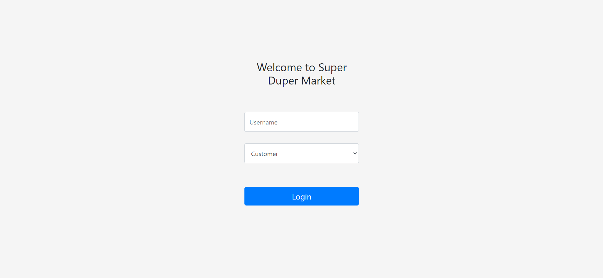
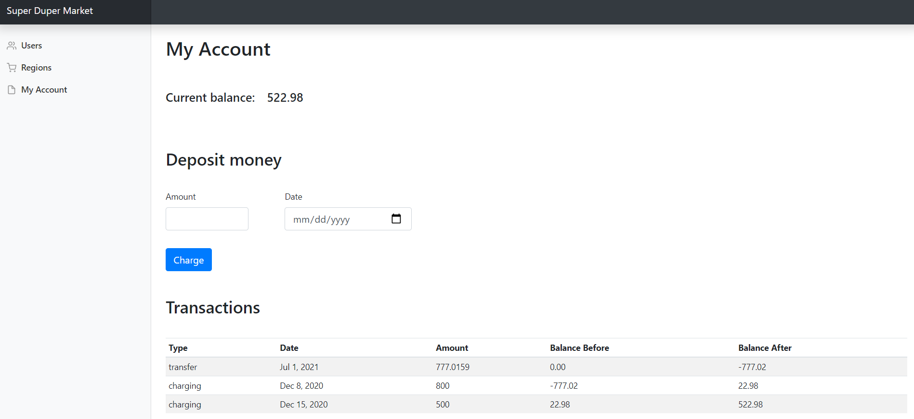
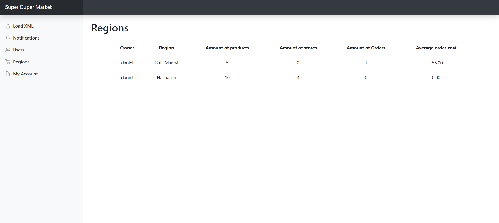
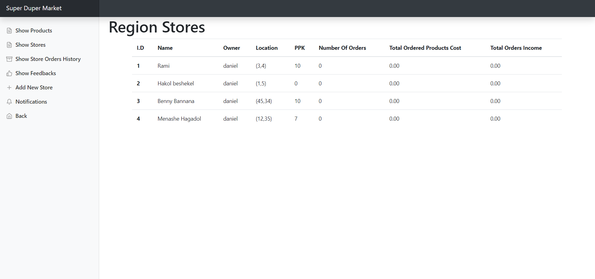
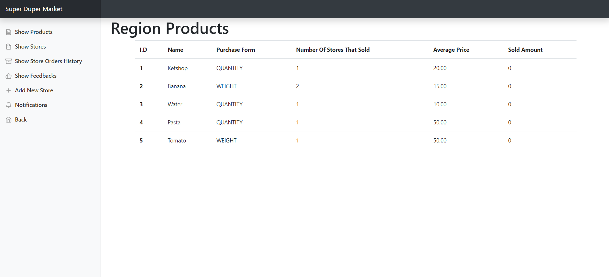
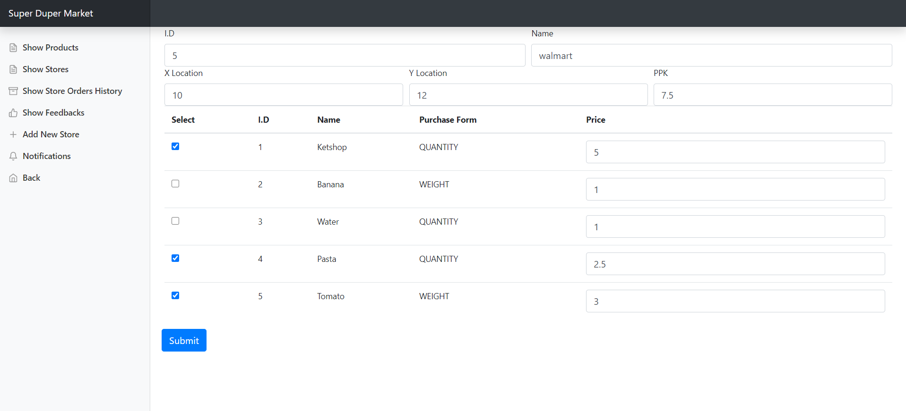
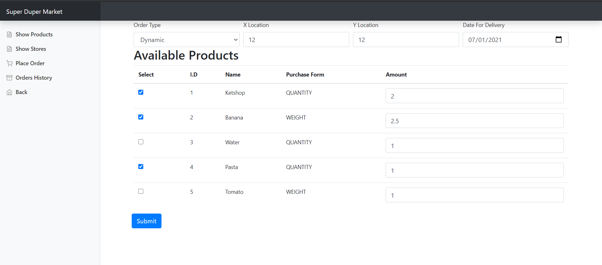
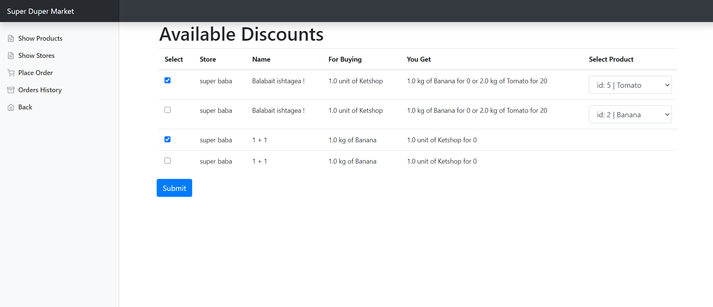
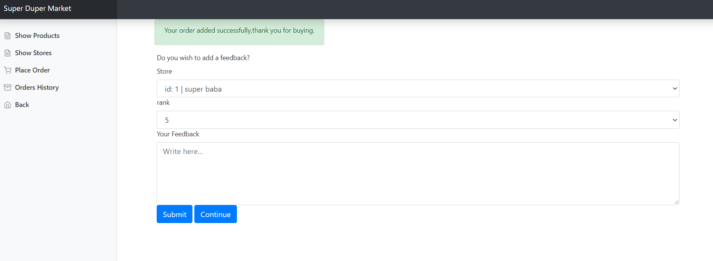

# Welcome to Super Duper Market
Hi!
In this project I develop a web app that alow to store sellers define 
theris store in this web and alow customer to make orders

## Screenshots











### Place order process






## Built With

* Java - Java is a class-based, object-oriented programming language.
* [IntelliJ ](https://www.jetbrains.com/idea/) - IntelliJ IDEA is an integrated development environment written in Java for developing computer software

* HTML -  is the standard markup language for documents designed to be displayed in a web browser.
* CSS - CSS is a style sheet language used for describing the presentation of a document written in a markup language such as HTML.
* JavaScript  - JavaScript is a scripting or programming language that allows you to implement complex features on web pages.
* [Bootstrap](https://getbootstrap.com/) - Bootstrap is a free and open-source CSS framework directed at responsive, mobile-first front-end web development. It contains CSS- and JavaScript-based design templates for typography, forms, buttons, navigation, and other interface components


```
